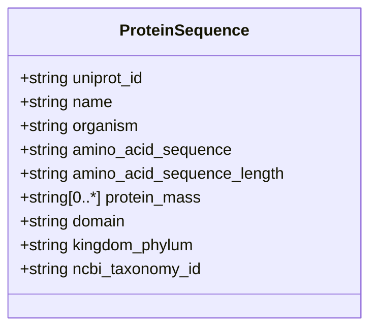

```mermaid
classDiagram
    
    class ProteinSequence {
        +string uniprot_id
        +string name
        +string organism
        +string amino_acid_sequence
        +string amino_acid_sequence_length
        +string[0..*] protein_mass
        +string domain
        +string kingdom_phylum
        +string ncbi_taxonomy_id
    }
    
```